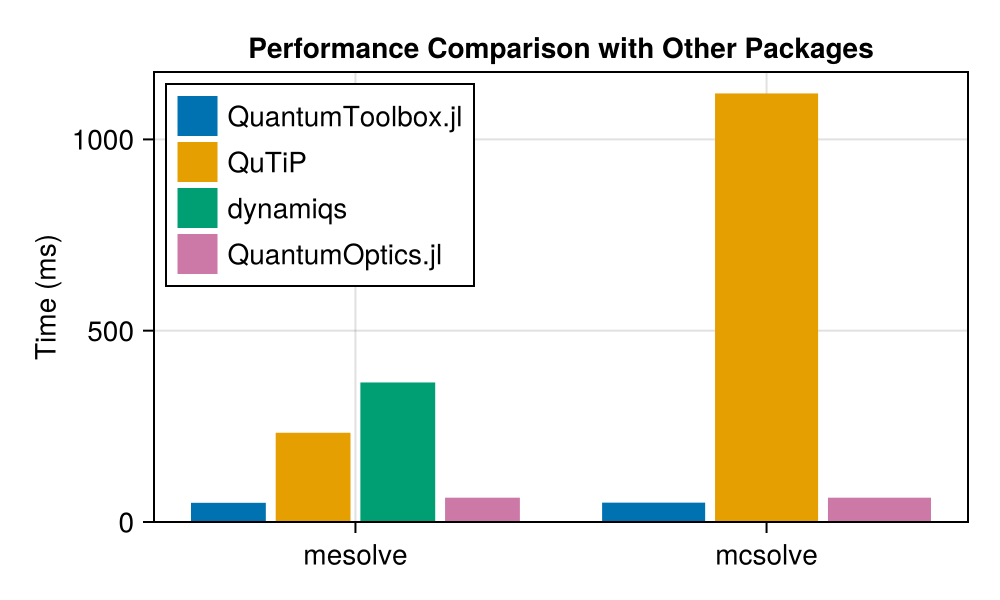

```@meta
EditURL = "../../../benchmarks/package_comparison/package_comparison.jl"
```

# Performance Comparison of Quantum Simulation Packages: Julia vs. Python

Here we compare the performance of [`QuantumToolbox.jl`](https://github.com/qutip/QuantumToolbox.jl) with other quantum simulation packages:
- [`QuTiP`](https://github.com/qutip/qutip) (Python)
- [`dynamiqs`](https://github.com/dynamiqs/dynamiqs) (Python - JAX)
- [`QuantumOptics.jl`](https://github.com/qojulia/QuantumOptics.jl) (Julia)

To allow reproducibility, this page is generated with [`Literate.jl`](https://github.com/fredrikekre/Literate.jl) based on [this envitonment](https://github.com/qutip/QuantumToolbox.jl/blob/main/benchmarks/package_comparison). Moreover, to keep the code clean, we use the [`PythonCall.jl`](https://github.com/JuliaPy/PythonCall.jl) package to call Python code from Julia. We tested that the overhead of calling Python code from Julia is negligible for the purpose of this benchmark.

## Importing the Required Packages

````julia
import QuantumToolbox
import QuantumOptics
using CairoMakie
using PythonCall
using BenchmarkTools

np = pyimport("numpy")
qutip = pyimport("qutip")
jax = pyimport("jax")
jnp = jax.numpy
dynamiqs = pyimport("dynamiqs")

dynamiqs.set_device("cpu")
````

````
Python: None
````

## Master Equation simulation

Parameters:

````julia
N = 50
Δ = 0.1
F = 2
γ = 1
nth = 0.8
````

````
0.8
````

### QuantumToolbox.jl

````julia
a = QuantumToolbox.destroy(N)
H = Δ * a' * a + F * (a + a')
c_ops = [sqrt(γ * (1 + nth)) * a, sqrt(γ * nth) * a']

tlist = range(0, 10, 100)
ψ0 = QuantumToolbox.fock(N, 0)

QuantumToolbox.mesolve(H, ψ0, tlist, c_ops, progress_bar = Val(false)).states[2] # Warm-up

mesolve_quantumtoolbox = @benchmark QuantumToolbox.mesolve($H, $ψ0, $tlist, $c_ops, progress_bar = Val(false)).states[2]
````

````
BenchmarkTools.Trial: 100 samples with 1 evaluation.
 Range (min … max):  48.879 ms … 56.787 ms  ┊ GC (min … max): 0.00% … 10.96%
 Time  (median):     49.815 ms              ┊ GC (median):    0.69%
 Time  (mean ± σ):   50.165 ms ±  1.183 ms  ┊ GC (mean ± σ):  0.68% ±  1.54%

      ▂▄█▇██ ▂ ▁                                               
  ▆▅▅▆██████▆█▅█▁▆▃▃▃▃▁▃▁▅▃▃▃▅▁▅▁▁▁▁▁▃▃▃▁▁▁▁▁▁▁▁▁▁▁▁▁▁▁▁▁▁▁▁▃ ▃
  48.9 ms         Histogram: frequency by time        55.1 ms <

 Memory estimate: 7.42 MiB, allocs estimate: 802.
````

### QuTiP

````julia
a = qutip.destroy(N)
H = Δ * a.dag() * a + F * (a + a.dag())
c_ops = pylist([np.sqrt(γ * (1 + nth)) * a, np.sqrt(γ * nth) * a.dag()])

tlist = np.linspace(0, 10, 100)
ψ0 = qutip.fock(N, 0)

qutip.mesolve(H, ψ0, tlist, c_ops).states[1] # Warm-up

mesolve_qutip = @benchmark qutip.mesolve($H, $ψ0, $tlist, $c_ops).states[1]
````

````
BenchmarkTools.Trial: 22 samples with 1 evaluation.
 Range (min … max):  231.944 ms … 235.554 ms  ┊ GC (min … max): 0.00% … 0.00%
 Time  (median):     233.001 ms               ┊ GC (median):    0.00%
 Time  (mean ± σ):   233.284 ms ±   1.056 ms  ┊ GC (mean ± σ):  0.00% ± 0.00%

             ▃     █    ▃                                        
  ▇▁▇▇▁▁▁▁▁▇▁█▇▁▇▁▇█▇▁▁▇█▇▁▁▁▁▇▁▁▁▁▁▁▁▁▁▁▁▁▁▁▁▁▁▇▁▁▁▁▁▁▁▁▁▁▇▁▇▇ ▁
  232 ms           Histogram: frequency by time          236 ms <

 Memory estimate: 464 bytes, allocs estimate: 20.
````

### dynamiqs

````julia
a = dynamiqs.destroy(N)
H = Δ * jnp.matmul(dynamiqs.dag(a), a) + F * (a + dynamiqs.dag(a))
c_ops = [jnp.sqrt(γ * (1 + nth)) * a, jnp.sqrt(γ * nth) * dynamiqs.dag(a)]

tlist = jnp.linspace(0, 10, 100)
ψ0 = dynamiqs.fock(N, 0)

dynamiqs.mesolve(H, c_ops, ψ0, tlist, options = dynamiqs.Options(progress_meter = nothing)).states # Warm-up

mesolve_dynamiqs =
    @benchmark dynamiqs.mesolve($H, $c_ops, $ψ0, $tlist, options = dynamiqs.Options(progress_meter = nothing)).states
````

````
BenchmarkTools.Trial: 14 samples with 1 evaluation.
 Range (min … max):  198.221 ms … 382.351 ms  ┊ GC (min … max): 0.00% … 0.00%
 Time  (median):     377.235 ms               ┊ GC (median):    0.00%
 Time  (mean ± σ):   364.688 ms ±  48.001 ms  ┊ GC (mean ± σ):  0.00% ± 0.00%

                                                            ███  
  ▆▁▁▁▁▁▁▁▁▁▁▁▁▁▁▁▁▁▁▁▁▁▁▁▁▁▁▁▁▁▁▁▁▁▁▁▁▁▁▁▁▁▁▁▁▁▁▁▁▁▁▁▁▁▁▁▁▆███ ▁
  198 ms           Histogram: frequency by time          382 ms <

 Memory estimate: 1.45 KiB, allocs estimate: 66.
````

### QuantumOptics.jl

````julia
bas = QuantumOptics.FockBasis(N)
a = QuantumOptics.destroy(bas)

H = Δ * a' * a + F * (a + a')
c_ops = [sqrt(γ * (1 + nth)) * a, sqrt(γ * nth) * a']

tlist = range(0, 10, 100)
ψ0 = QuantumOptics.fockstate(bas, 0)

QuantumOptics.timeevolution.master(tlist, ψ0, H, c_ops)[2][2]

mesolve_quantumoptics = @benchmark QuantumOptics.timeevolution.master($tlist, $ψ0, $H, $c_ops)
````

````
BenchmarkTools.Trial: 56 samples with 1 evaluation.
 Range (min … max):  88.118 ms … 92.803 ms  ┊ GC (min … max): 0.00% … 0.00%
 Time  (median):     89.988 ms              ┊ GC (median):    0.00%
 Time  (mean ± σ):   90.326 ms ±  1.073 ms  ┊ GC (mean ± σ):  0.15% ± 0.43%

                 ▁     ▃ █            ▁                        
  ▄▁▁▁▁▁▄▁▄▇▁▁▁▁▁█▁▄▄▇▇█▇█▄▇▄▄▁▄▇▄▄▁▇▁█▁▄▄▄▄▁▄▁▄▁▇▄▁▁▁▁▄▁▄▄▁▇ ▁
  88.1 ms         Histogram: frequency by time        92.5 ms <

 Memory estimate: 4.78 MiB, allocs estimate: 643.
````

## Monte Carlo quantum trajectories simulation

Parameters:

````julia
N = 50
Δ = 0.1
F = 2
γ = 1
nth = 0.8
ntraj = 100
````

````
100
````

### QuantumToolbox.jl

````julia
a = QuantumToolbox.destroy(N)
H = Δ * a' * a + F * (a + a')
c_ops = [sqrt(γ * (1 + nth)) * a, sqrt(γ * nth) * a']

tlist = range(0, 10, 100)
ψ0 = QuantumToolbox.fock(N, 0)

QuantumToolbox.mcsolve(H, ψ0, tlist, c_ops, progress_bar = Val(false), ntraj = ntraj).states[2] # Warm-up

mcsolve_quantumtoolbox =
    @benchmark QuantumToolbox.mcsolve($H, $ψ0, $tlist, $c_ops, progress_bar = Val(false), ntraj = ntraj).states[2]
````

````
BenchmarkTools.Trial: 99 samples with 1 evaluation.
 Range (min … max):  42.603 ms … 63.987 ms  ┊ GC (min … max): 0.00% … 17.19%
 Time  (median):     49.792 ms              ┊ GC (median):    0.00%
 Time  (mean ± σ):   50.602 ms ±  4.168 ms  ┊ GC (mean ± σ):  2.21% ±  3.09%

            ▁ ▁▃ ▁▁▃ ▁█▃▃▆▃     ▁▃  ▆      ▁                   
  ▄▁▄▁▄▇▁▇▇▄█▄██▄███▇██████▇▇▄▇▁██▄▁█▄▄▁▄▇▇█▁▁▄▁▄▄▇▄▁▁▄▁▁▁▁▁▄ ▁
  42.6 ms         Histogram: frequency by time        61.7 ms <

 Memory estimate: 13.87 MiB, allocs estimate: 45362.
````

### QuTiP

````julia
a = qutip.destroy(N)
H = Δ * a.dag() * a + F * (a + a.dag())
c_ops = pylist([np.sqrt(γ * (1 + nth)) * a, np.sqrt(γ * nth) * a.dag()])

tlist = np.linspace(0, 10, 100)
ψ0 = qutip.fock(N, 0)

qutip.mcsolve(
    H,
    ψ0,
    tlist,
    c_ops,
    ntraj = ntraj,
    options = pydict(Dict("progress_bar" => false, "map" => "parallel", "num_cpus" => Threads.nthreads())),
).states[1] # Warm-up

mcsolve_qutip = @benchmark qutip.mcsolve(
    $H,
    $ψ0,
    $tlist,
    $c_ops,
    ntraj = ntraj,
    options = pydict(Dict("progress_bar" => false, "map" => "parallel", "num_cpus" => Threads.nthreads())),
).states[1]
````

````
BenchmarkTools.Trial: 5 samples with 1 evaluation.
 Range (min … max):  1.083 s …   1.144 s  ┊ GC (min … max): 0.00% … 0.00%
 Time  (median):     1.124 s              ┊ GC (median):    0.00%
 Time  (mean ± σ):   1.120 s ± 22.575 ms  ┊ GC (mean ± σ):  0.00% ± 0.00%

  █                                   ██    █             █  
  █▁▁▁▁▁▁▁▁▁▁▁▁▁▁▁▁▁▁▁▁▁▁▁▁▁▁▁▁▁▁▁▁▁▁▁██▁▁▁▁█▁▁▁▁▁▁▁▁▁▁▁▁▁█ ▁
  1.08 s         Histogram: frequency by time        1.14 s <

 Memory estimate: 1.95 KiB, allocs estimate: 51.
````

### dynamiqs (not yet implemented)

### QuantumOptics.jl

````julia
bas = QuantumOptics.FockBasis(N)
a = QuantumOptics.destroy(bas)

H = Δ * a' * a + F * (a + a')
c_ops = [sqrt(γ * (1 + nth)) * a, sqrt(γ * nth) * a']

tlist = range(0, 10, 100)
ψ0 = QuantumOptics.fockstate(bas, 0)

function quantumoptics_mcwf(tlist, ψ0, H, c_ops, ntraj)
    Threads.@threads for i in 1:ntraj
        QuantumOptics.timeevolution.mcwf(tlist, ψ0, H, c_ops, display_beforeevent = true, display_afterevent = true)[2][2]
    end
end

quantumoptics_mcwf(tlist, ψ0, H, c_ops, ntraj) # Warm-up

mesolve_quantumoptics = @benchmark quantumoptics_mcwf($tlist, $ψ0, $H, $c_ops, ntraj)
````

````
BenchmarkTools.Trial: 79 samples with 1 evaluation.
 Range (min … max):  54.646 ms … 74.745 ms  ┊ GC (min … max): 10.87% … 9.28%
 Time  (median):     64.055 ms              ┊ GC (median):    10.06%
 Time  (mean ± σ):   63.548 ms ±  3.843 ms  ┊ GC (mean ± σ):  10.75% ± 3.47%

                         ▂▂  ▂   ▂▂█▂▂▂▅  █ ▂▅                 
  ▅▅▅▅▁▁▁▁▅▁▅█▅▁▅█▅▅▁▅▅█▅██▁▅█▅▅▁███████▅▁█▁███▅▁▅▅▅▅▅▅▁▁▁▁▁▅ ▁
  54.6 ms         Histogram: frequency by time        71.3 ms <

 Memory estimate: 74.28 MiB, allocs estimate: 232455.
````

## Plotting the Results

````julia
mesolve_times = [
    1e-6 * sum(m.times) / length(m.times) for
    m in [mesolve_quantumtoolbox, mesolve_qutip, mesolve_dynamiqs, mesolve_quantumoptics]
]
mcsolve_times =
    [1e-6 * sum(m.times) / length(m.times) for m in [mcsolve_quantumtoolbox, mcsolve_qutip, mesolve_quantumoptics]]

#

fig = Figure(size = (500, 300))
ax = Axis(
    fig[1, 1],
    xticks = (1:2, ["mesolve", "mcsolve"]),
    ylabel = "Time (ms)",
    title = "Performance Comparison with Other Packages",
)

colors = Makie.wong_colors()

barplot!(
    ax,
    ones(length(mesolve_times)),
    mesolve_times,
    dodge = 1:length(mesolve_times),
    color = colors[1:length(mesolve_times)],
)

barplot!(ax, 2 * ones(length(mcsolve_times)), mcsolve_times, dodge = 1:length(mcsolve_times), color = colors[[1, 2, 4]])

ylims!(ax, 0, nothing)
````

Legend

````julia
labels = ["QuantumToolbox.jl", "QuTiP", "dynamiqs", "QuantumOptics.jl"]
elements = [PolyElement(polycolor = colors[i]) for i in 1:length(labels)]

axislegend(ax, elements, labels, position = :lt)

save("package_comparison.png", fig);

# fig
````



---

## System Information

````julia
using InteractiveUtils

versioninfo()
````

````
Julia Version 1.11.1
Commit 8f5b7ca12ad (2024-10-16 10:53 UTC)
Build Info:
  Official https://julialang.org/ release
Platform Info:
  OS: Linux (x86_64-linux-gnu)
  CPU: 32 × 13th Gen Intel(R) Core(TM) i9-13900KF
  WORD_SIZE: 64
  LLVM: libLLVM-16.0.6 (ORCJIT, alderlake)
Threads: 16 default, 0 interactive, 8 GC (on 32 virtual cores)
Environment:
  JULIA_CONDAPKG_BACKEND = Null
  JULIA_PYTHONCALL_EXE = /home/alberto/.julia/dev/QuantumToolbox/benchmarks/package_comparison/pyenv/bin/python
  LD_LIBRARY_PATH = /usr/local/lib:
  JULIA_NUM_THREADS = 16

````

---

````julia
QuantumToolbox.about()
````

````

 QuantumToolbox.jl: Quantum Toolbox in Julia
≡≡≡≡≡≡≡≡≡≡≡≡≡≡≡≡≡≡≡≡≡≡≡≡≡≡≡≡≡≡≡≡≡≡≡≡≡≡≡≡≡≡≡≡≡
Copyright © QuTiP team 2022 and later.
Current admin team:
    Alberto Mercurio and Yi-Te Huang

Package information:
====================================
Julia              Ver. 1.11.1
QuantumToolbox     Ver. 0.21.5
SciMLOperators     Ver. 0.3.12
LinearSolve        Ver. 2.37.0
OrdinaryDiffEqCore Ver. 1.11.0

System information:
====================================
OS       : Linux (x86_64-linux-gnu)
CPU      : 32 × 13th Gen Intel(R) Core(TM) i9-13900KF
Memory   : 62.514 GB
WORD_SIZE: 64
LIBM     : libopenlibm
LLVM     : libLLVM-16.0.6 (ORCJIT, alderlake)
BLAS     : libopenblas64_.so (ilp64)
Threads  : 16 (on 32 virtual cores)


````

---

````julia
qutip.about()
````

````
Python: None
````

---

*This page was generated using [Literate.jl](https://github.com/fredrikekre/Literate.jl).*

