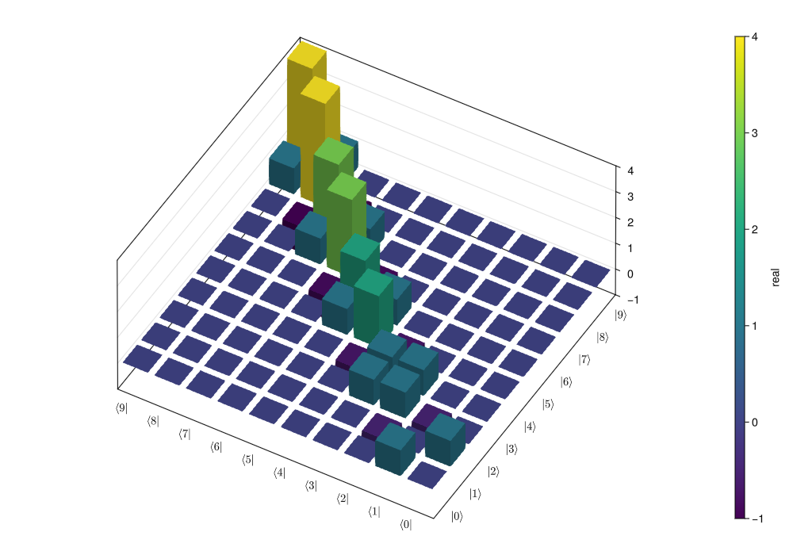

# [Visualization of quantum states and operators](@id doc:Visualization-of-quantum-states-and-operators)

Visualization is often an important complement to the simulation of a quantum mechanical system. The first method of visualization that comes to mind might be to plot the expectation values of a few selected operators. But on top of that, it can often be instructive to visualize for example the state vectors, density matrices, Hamiltonian, or Liouvillian. In this section, we demonstrate how `QuantumToolbox.jl` and [`Makie.jl`](https://github.com/MakieOrg/Makie.jl) can be used to perform several types of visualizations that often can provide additional understanding of quantum system.

```@example visualization
using CairoMakie
```

```@setup visualization
using QuantumToolbox
CairoMakie.enable_only_mime!(MIME"image/svg+xml"())
```

!!! note "Import plotting libraries"
    Remember to import plotting libraries first.

## Fock-basis probability distribution

In quantum mechanics, probability distributions plays an important role, and as in statistics, the expectation values computed from a probability distribution do not reveal the full story. For example, consider an quantum harmonic oscillator mode with Hamiltonian ``\hat{H}=\hbar\omega\hat{a}^\dagger\hat{a}``, which is in a state described by its density matrix ``\hat{\rho}``, and which on average is occupied by two photons, ``\textrm{Tr}[\hat{a}^\dagger\hat{a}\hat{\rho}] = 2``. Given this information we cannot say whether the oscillator is in a Fock state, a thermal state, a coherent state, etc. By visualizing the photon distribution in the Fock state basis important clues about the underlying state can be obtained.

One convenient way to visualize a probability distribution is to use histograms. Consider the following histogram visualization of the number-basis probability distribution, which can be obtained from the diagonal of the density matrix, for a few possible oscillator states with on average occupation of two photons.

First we generate the density matrices for the coherent, thermal and Fock states.

```@example visualization
N = 20

ρ_coherent = coherent_dm(N, sqrt(2))
ρ_thermal = thermal_dm(N, 2)
ρ_fock = fock_dm(N, 2)
nothing # hide
```

`QuantumToolbox.jl` provides a convenient function [`plot_fock_distribution`](@ref) to visualize the Fock-distribution:

```@example visualization
fig = Figure(size = (600, 350))

# only show several x-labels
fock_numbers = [
    "0", "", "", "", "", "5", "", "", "", "",
    "10", "", "", "", "", "15", "", "", "", "19",
]

_, ax1, _ = plot_fock_distribution(ρ_coherent; location=fig[1,1], fock_numbers=fock_numbers)
ax1.title = "Coherent state"

_, ax2, _ =plot_fock_distribution(ρ_thermal; location=fig[1,2], fock_numbers=fock_numbers)
ax2.title = "Thermal state"

_, ax3, _ =plot_fock_distribution(ρ_fock; location=fig[1,3], fock_numbers=fock_numbers)
ax3.title = "Fock state"

fig
```

## Quasi-probability distributions

The probability distribution in the number (Fock) basis only describes the occupation probabilities for a discrete set of states. A more complete phase-space probability-distribution-like function for harmonic modes are the Wigner and Husimi Q-functions, which provide full descriptions of the quantum state (equivalent to the density matrix). These are called quasi-distribution functions because unlike real probability distribution functions they can for example be negative. In addition to being more complete descriptions of a state (compared to only the occupation probabilities plotted above), these distributions are also great for demonstrating if a quantum state is quantum mechanical, since for example a negative Wigner function is a definite indicator that a state is distinctly nonclassical.

### Wigner function

In `QuantumToolbox.jl`, the Wigner function for a harmonic mode can be calculated with the function [`wigner`](@ref). It takes a ket or a density matrix as input, together with arrays that define the ranges of the phase-space coordinates (in the ``x``-``y`` plane).

In the following example, the Wigner functions are calculated and plotted for the same three states as in the previous section by calling the function [`plot_wigner`](@ref):

```@example visualization
fig = Figure(size = (600, 200))

xvec = LinRange(-5, 5, 200)

_, ax1, _ = plot_wigner(ρ_coherent; xvec=xvec, yvec=xvec, location=fig[1,1])
ax1.title = "Coherent state"
ax1.aspect = 1 # make plot as square-size

_, ax2, _ = plot_wigner(ρ_thermal; xvec=xvec, yvec=xvec, location=fig[1,2])
ax2.title = "Thermal state"
ax2.aspect = 1 # make plot as square-size

_, ax3, _ = plot_wigner(ρ_fock; xvec=xvec, yvec=xvec, location=fig[1,3])
ax3.title = "Fock state"
ax3.aspect = 1 # make plot as square-size

fig
```

## Visualizing operators

Sometimes, it may also be useful to directly visualizing the underlying matrix representation of an operator. The density matrix, for example, is an operator whose elements can give insights about the state it represents, but one might also be interesting in plotting the matrix of an Hamiltonian to inspect the structure and relative importance of various elements.

`QuantumToolbox.jl` offers a few functions for quickly visualizing matrix data in the form of 2D heatmap ([`matrix_heatmap`](@ref)) and 3D histogram ([`matrix_histogram`](@ref)).

For example, to illustrate the use of these functions, let’s visualize the Jaynes-Cummings Hamiltonian:

```@example visualization
N = 5
a = tensor(destroy(N), qeye(2))
σm = tensor(qeye(N), destroy(2))
sx = tensor(qeye(N), sigmax())
H = a' * a + sx - 0.5 * (a * σm' + a' * σm)

fig = Figure(size = (500, 350))
matrix_heatmap(H; location = fig[1,1])

fig
```

We can also handle the matrix elements with different `method` (keyword argument) before plotting them: 

- `method = Val(:real)`: the real part of each element
- `method = Val(:imag)`: the imaginary part of each element
- `method = Val(:abs)`: the absolute value of each element
- `method = Val(:angle)`: the (complex) phase angle in radians of each element

For example, the `real` and `imag`inary parts of [`steadystate`](@ref) can be visualized by:

```@example visualization
# collapse operators
c_ops = (
    sqrt(0.01) * σm,
    sqrt(0.01) * a,
)
ρss = steadystate(H, c_ops)

fig = Figure(size = (350, 500))

matrix_heatmap(ρss; method = Val(:real), location = fig[1,1])
matrix_heatmap(ρss; method = Val(:imag), location = fig[2,1])

fig
```

Similarly, we can use the function [`matrix_histogram`](@ref) to visualize the above Hamiltonian in a 3D histogram:

!!! warning "Backend"
    `CairoMakie` is not the best backend for handling 3D shading, we suggest to use `GLMakie` for [`matrix_histogram`](@ref).

```julia
using GLMakie # requires OpenGL: a backend better for 3D shading

fig = Figure(size = (500, 350))

matrix_histogram(H; location = fig[1,1])

fig
```


